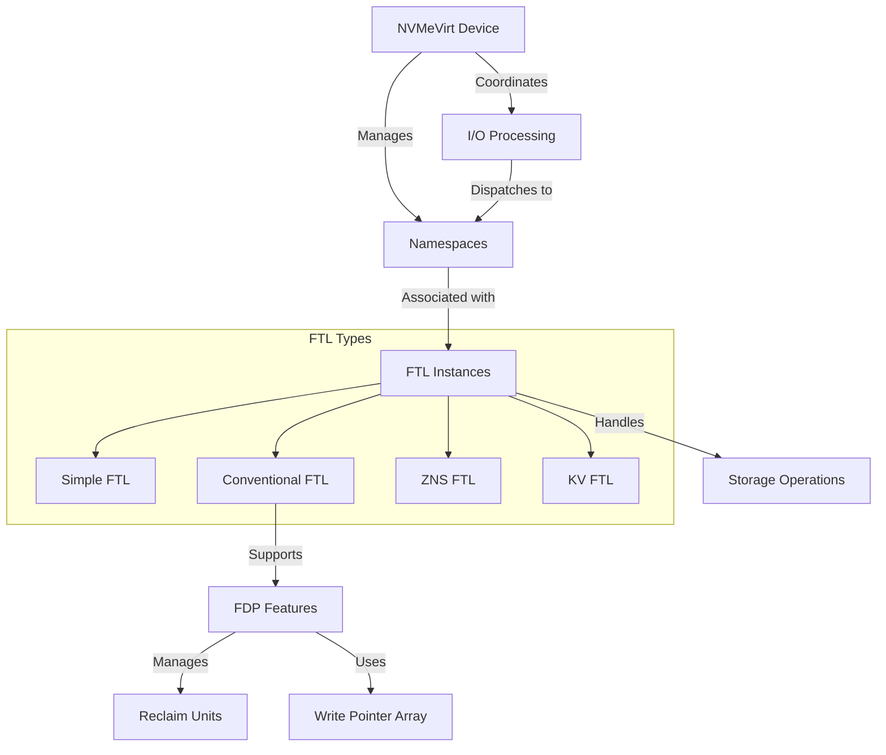

# NVMeVirt 架构





# Quick Start

## 配置

```bash
sudo insmod ./nvmev.ko \
  memmap_start=128G \       # e.g., 1M, 4G, 8T
  memmap_size=64G   \       # e.g., 1M, 4G, 8T
  cpus=7,8                  # List of CPU cores to process I/O requests (should have at least 2)
```

## 启动

```bash

```