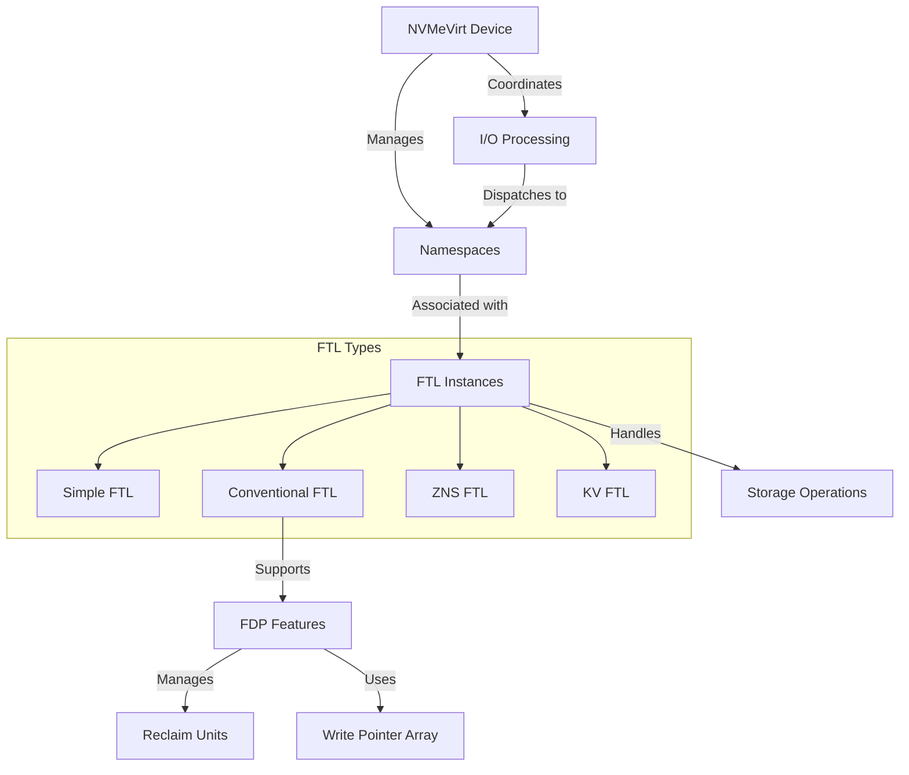

# FDPVirt Quick Start
## 环境配置
  同Nvmevirt

1.配置Kbuild
CONFIG_NVMEVIRT_NVM := y
#CONFIG_NVMEVIRT_SSD := y
#CONFIG_NVMEVIRT_ZNS := y
#CONFIG_NVMEVIRT_KV := y
CONFIG_NVMEVIRT_FDP := y

2.编译
make

## 启动
```bash 
# 使用16G起始的保留区域
# (需要根据服务器内存情况设置，查看命令：cat /proc/iomem | grep -E "(Reserved|ram|System RAM)")
insmod nvmev.ko memmap_start=16G memmap_size=1G cpus=0,1

# 检查消息，验证启动:
sudo dmesg | grep  NVMe 

```

> Ubuntu22.04，需要手动安装nvme-cli验证
1. ubuntu22.04默认的nvme-cli 1.16不支持FDP，手动编译安装最新的2.14，
	1. 依赖于libnvme，默认的版本是1.3，至少要1.6

```bash
#手动安装libnvme
git clone https://github.com/linux-nvme/libnvme.git
cd libnvme
git checkout v1.10  # 
meson setup build
ninja -C build
sudo ninja -C build install
# 更新动态链接库
sudo ldconfig
# 验证版本:是否1.3->1.10
pkg-config --modversion libnvme
```

卸载掉旧的nvme-cli,手动安装v2.10(匹配libnvme v1.10)

```bash
rm -rf build
meson setup build
ninja -C build
sudo ninja -C build install
# 验证：
nvme --version                           
nvme version 2.10 (git 2.10)
libnvme version 1.10 (git 1.10)
```


# NVMeVirt 架构





# Quick Start

## 配置

```bash
sudo insmod ./nvmev.ko \
  memmap_start=128G \       # e.g., 1M, 4G, 8T
  memmap_size=64G   \       # e.g., 1M, 4G, 8T
  cpus=7,8                  # List of CPU cores to process I/O requests (should have at least 2)
```

## 启动

```bash

```