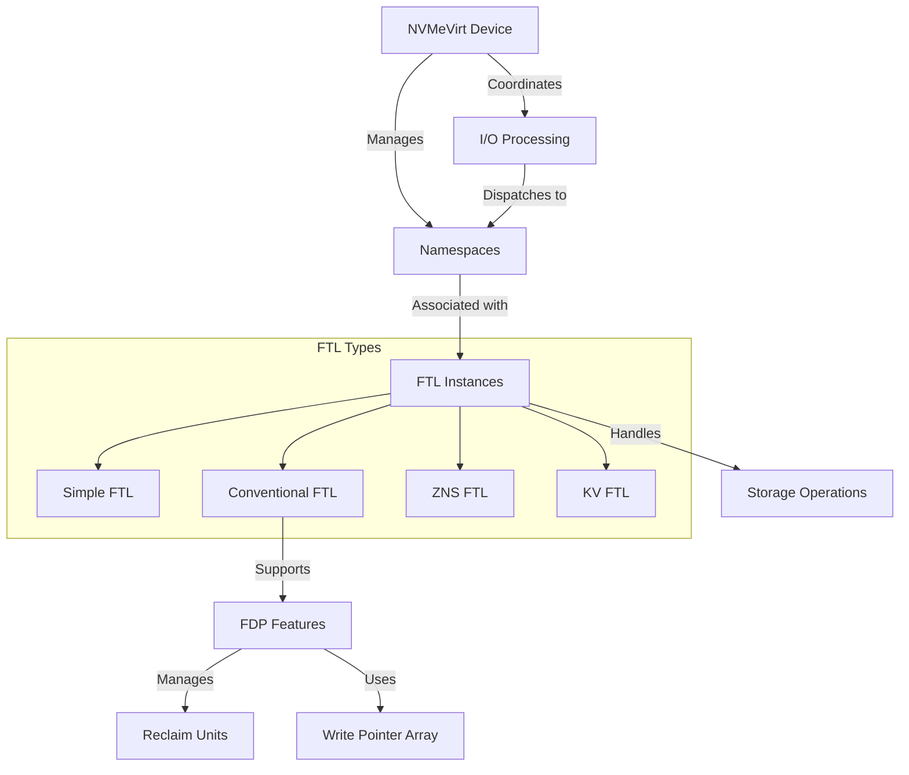

# FDPVirt Quick Start
## 环境配置
  同Nvmevirt

1. 配置SSD类型
NVMeVirt支持模拟多种不同类型的SSD设备，切换方法是通过修改Kbuild文件中的配置选项：
```bash
CONFIG_NVMEVIRT_NVM := y
#CONFIG_NVMEVIRT_SSD := y
#CONFIG_NVMEVIRT_ZNS := y
#CONFIG_NVMEVIRT_KV := y
CONFIG_NVMEVIRT_FDP := y
```

2. 编译

每次切换SSD类型都需要重新编译内核模块
不同SSD类型会编译进不同的源文件，如simple_ftl.o用于NVM，conv_ftl.o用于传统SSD等
项目支持多种高级存储配置，如NVMe-oF目标卸载、内核绕过和PCI点对点通信
推荐使用isolcpus配置来避免调度器将任务放在NVMeVirt使用的CPU上

## 启动
```bash 
# 使用16G起始的保留区域
# (需要根据服务器内存情况设置，查看命令：cat /proc/iomem | grep -E "(Reserved|ram|System RAM)")
insmod nvmev.ko memmap_start=16G memmap_size=1G cpus=0,1

# 检查消息，验证启动:
sudo dmesg | grep  NVMe 

```


# FDPVirt 架构



# Quick Start

## 配置

```bash
sudo insmod ./nvmev.ko \
  memmap_start=128G \       # e.g., 1M, 4G, 8T
  memmap_size=64G   \       # e.g., 1M, 4G, 8T
  cpus=7,8                  # List of CPU cores to process I/O requests (should have at least 2)
```

## 启动

```bash

```