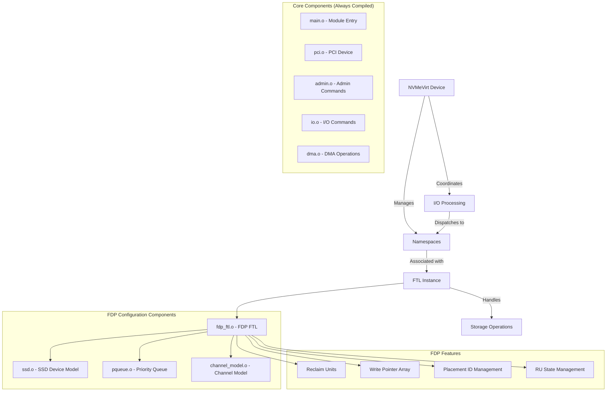

# FDP (Flexible Data Placement) 开发指南

## FDP 概述

Flexible Data Placement (FDP) 是 NVMe 协议的一个扩展，允许主机指定数据在 SSD 中的放置位置。这对于优化写入性能、减少写入放大和提高 SSD 寿命非常重要。

## FDP 架构图
    


## FDP 核心概念

### 1. Reclaim Unit (RU)
- 数据回收的基本单位
- 每个 RU 包含多个逻辑块
- 支持独立的数据回收操作

### 2. Write Pointer
- 指向当前可写入的位置
- 每个 RU 有独立的写指针
- 支持顺序写入优化

### 3. Placement ID
- 标识数据放置策略
- 主机可以指定不同的 Placement ID
- 影响数据在 SSD 中的物理位置

## FDP 实现架构

### 文件结构
```
src/
├── fdp_ftl.c          # FDP FTL 主要实现
└── fdp_ftl.h          # FDP FTL 接口定义

include/
├── fdp_ftl.h          # FDP 数据结构定义
└── ssd.h              # SSD 基础结构
```

### 核心数据结构

#### FDP FTL 结构
```c
struct fdp_ftl {
    struct ssd *ssd;                    // SSD 设备
    struct fdp_params fp;               // FDP 参数
    struct reclaim_unit *reclaim_units; // 回收单元数组
    struct write_pointer *write_ptrs;   // 写指针数组
    void *storage_base_addr;            // 存储基地址
};
```

#### 回收单元结构
```c
struct reclaim_unit {
    uint32_t ru_id;                     // RU ID
    uint32_t state;                     // RU 状态
    uint64_t start_lba;                 // 起始 LBA
    uint64_t end_lba;                   // 结束 LBA
    uint64_t write_pointer;             // 写指针位置
};
```

## FDP 命令处理

### 1. 写入命令处理
```c
bool fdp_write(struct nvmev_ns *ns, struct nvmev_request *req, struct nvmev_result *ret)
{
    // 1. 解析 Placement ID
    // 2. 选择对应的 Reclaim Unit
    // 3. 更新写指针
    // 4. 执行写入操作
    // 5. 返回结果
}
```

### 2. 读取命令处理
```c
bool fdp_read(struct nvmev_ns *ns, struct nvmev_request *req, struct nvmev_result *ret)
{
    // 1. 解析 LBA 范围
    // 2. 查找对应的 Reclaim Unit
    // 3. 执行读取操作
    // 4. 返回数据
}
```

### 3. 管理命令处理
```c
void fdp_mgmt_send(struct nvmev_ns *ns, struct nvmev_request *req, struct nvmev_result *ret)
{
    // 处理 FDP 管理命令
    // 如 RU 分配、释放等
}
```

## 开发要点

### 1. 内存管理
- 为每个 RU 分配独立的内存区域
- 管理写指针数组
- 处理内存映射

### 2. 并发控制
- 多线程访问保护
- 写指针同步
- RU 状态管理

### 3. 性能优化
- 批量写入优化
- 写指针预分配
- 缓存管理

### 4. 错误处理
- RU 分配失败处理
- 写入失败恢复
- 状态一致性检查

## 配置参数

### FDP 参数配置
```c
struct fdp_params {
    uint32_t nr_rus;           // 回收单元数量
    uint32_t ru_size;          // RU 大小 (LBA)
    uint32_t max_placement_id; // 最大 Placement ID
    uint32_t write_buffer_size; // 写缓冲区大小
};
```

### 编译配置
在 `Kbuild` 中启用 FDP：
```bash
CONFIG_NVMEVIRT_FDP := y
```

## 测试和验证

### 1. 功能测试
- RU 分配和释放测试
- 写入和读取测试
- Placement ID 测试

### 2. 性能测试
- 吞吐量测试
- 延迟测试
- 并发测试

### 3. 压力测试
- 长时间运行测试
- 内存压力测试
- 并发压力测试

## 调试技巧

### 1. 日志输出
```c
#define FDP_DEBUG(fmt, ...) \
    printk(KERN_INFO "FDP: " fmt, ##__VA_ARGS__)
```

### 2. 状态检查
- 定期检查 RU 状态
- 验证写指针一致性
- 监控内存使用

### 3. 性能监控
- 跟踪写入延迟
- 监控 RU 利用率
- 统计错误率

## 常见问题

### 1. 内存不足
- 检查 RU 数量配置
- 优化内存分配策略
- 考虑动态分配

### 2. 性能问题
- 检查写指针更新频率
- 优化批量写入
- 调整缓冲区大小

### 3. 数据一致性
- 确保写指针同步
- 验证 RU 状态
- 检查错误恢复

## 扩展开发

### 1. 添加新的 Placement 策略
- 定义新的 Placement ID
- 实现对应的写入逻辑
- 添加配置参数

### 2. 优化回收算法
- 实现智能 RU 选择
- 优化写指针管理
- 添加预测性分配

### 3. 增强监控功能
- 添加性能统计
- 实现健康检查
- 提供调试接口 